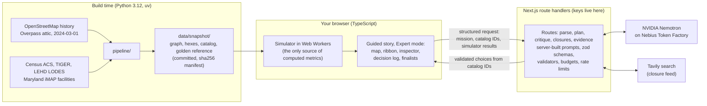

# WorldSeed

**Don't predict the future. Simulate it.**

*Regional averages hide local disasters. A good tool also shows what didn't break.*

Live demo: https://worldseed-mu.vercel.app (no login, runs in your browser)

A regional model says losing the Key Bridge costs about 3 seconds on average. For
about 20,000 people, mostly on the Sparrows Point / Edgemere peninsula, it cut more
than 10% of the jobs they can reach across the harbor within 30 minutes, and for the
eight hardest-hit block groups, 27-77%. (That head-count depends on speed and
time-budget assumptions: about 6,700 to 96,000 across the variants we tested. The
time-based measures, and which block groups are worst hit, are stable.) WorldSeed
puts those facts side by side, and shows the third: first-response times did not
change in the model, because both shores have their own stations. A fourth view,
hazmat trucks, shows the largest effect in minutes: vehicles carrying the hazardous
materials the MDTA lists are barred from both harbor tunnels, so with the bridge
removed, in the model, those trucks take the western I-695 arc and add about 15
minutes on average across 24 harbor trips, against about 6 for a car. That is a
simulation of one published rule, not route guidance.

WorldSeed is a counterfactual infrastructure-planning simulator and a screening
tool. It computes consequences on the 2024 OpenStreetMap road network at free-flow
speeds (congestion appears only in stress futures), with Census population and jobs
data. You remove a link and see who is affected. It then screens a catalog of 16
hypothetical scenario options for where mitigation would matter, with a
deterministic two-stage search that needs no AI key. An NVIDIA Nemotron planner on
Nebius Token Factory is built as an alternative planner and is not yet verified
against live models. No language model ever produces a number: the simulator
computes every metric, cited Census data supplies the population figures, and
application templates write every result sentence.

Built for the Nebius x NVIDIA Global AI Hackathon, track **Best Apps and Agents**.

> In memory of the six construction workers lost when the Francis Scott Key
> Bridge collapsed on March 26, 2024. This is a planning tool, not live dispatch.

## What it does

- **Loads a place at a date.** A 36,610-node drivable road graph built from
  OpenStreetMap history (2024-03-01) that includes the Key Bridge and both harbor
  tunnels, plus Census block groups, LEHD jobs, 74 fire stations, 2 ambulance
  stations and 10 hospitals.
- **Removes a link and recomputes.** One click on "Remove Key Bridge link" and every
  lens is recomputed on the road network, in your browser. Terrain rises where the
  change is.
- **Shows the answer honestly, side by side.** Three lenses stay visible at once:
  first response, regional job access, and cross-harbor job access. The region-wide
  number is never hidden behind the local one, and neither is the thing that held.
- **Times hazmat trucks.** 24 cross-harbor trips between 7 fixed road anchors at
  port and industrial sites, for two vehicle classes: a car, and a `hazmat_truck`,
  meaning a vehicle carrying the listed hazardous materials that the Maryland
  Transportation Authority (MDTA) bars from both harbor tunnels
  (https://mdta.maryland.gov/TunnelRestrictionsAndVehiclePermits, accessed 2026-09-26).
  Free-flow, bridge removed: cars add about 5.8 minutes on average, hazmat trucks
  about 14.7 (23 of the 24 hazmat trips add more than 5 minutes). Closing the Harbor
  Tunnel changes nothing for hazmat trucks, because they cannot use it anyway. See
  [Hazmat and freight trips](#hazmat-and-freight-trips) for what this is and is not.
- **Explains a place.** Click any hexagon for its block group, Census figures and
  the route that changed (dim = before, bright = now).
- **Screens hypothetical options.** Pick a goal: cross-harbor access, first response,
  or hazmat truck detours. A search scores bundles of up to three options from a
  16-entry catalog of hypothetical scenario options (3 temporary links, 8 corridor
  priorities, 3 staging sites, and 2 escorted hazmat windows that apply only to the
  hazmat goal). The no-AI search is two-stage: one deterministic run screens every
  eligible bundle, then the top 12 get paired stress futures; you compare finalists
  and decide. It screens; it does not design anything, and it does not fix the
  peninsula. See the finding below.
- **Checks live news, with you in the loop.** A Tavily lookup can propose current
  road closures near the model area. Nothing enters the model until you read the
  source and confirm it. (Built and tested; the live lookup is pending a deployed
  key.)

## Who it is for

Resilience and criticality screening for state DOT and metropolitan planning
organization analysts: the question "if this crossing is lost, who loses access, and
where would mitigation matter?" Emergency managers are a secondary audience, through
the first-response lens as a resilience check. It is screening, not design. The Key
Bridge is the case study. (Screening other crossings is [PLANNED]; the data pipeline
is configurable by bounding box, but the app is built around this one region today.)

WorldSeed is not affiliated with or endorsed by any agency.

## The finding

The obvious question, "did emergency response break?", has a boring answer. The
interesting result is somewhere else.

| Question | What the simulation shows, Key Bridge link removed |
| --- | --- |
| Did first-response times change? | **No. It held.** The simulated 90th-percentile time stays at 6.1 min; 96% of residents remain within 8 min. Both shores have their own fire stations and hospitals. |
| Did regional job access change? | **Barely.** About +3 seconds on the average drive to the region's main job centers. Most trips in the region never used the bridge. |
| Did cross-harbor job access change? | **Yes, for the Sparrows Point / Edgemere peninsula.** The 8 hardest-hit block groups lose 27-77% of the jobs on the other shore reachable within 30 minutes. About 20,000 residents lose more than 10% of those jobs (the app shows 20,100; the exact reference is 19,705); about 11,400 lose more than 25%. The worst-off 1% add at least 4.3 min to the average cross-harbor trip. **These counts depend on speed and time-budget assumptions: about 6,700 to 96,000 across the variants we tested.** The time-based measures (about 11 to 17 s average added) and the identity of the worst-hit block groups are stable. |
| Were low-wage workers hit harder? | **Not disproportionately.** 1,380 low-wage workers lose more than 10% of cross-harbor jobs: 1.8% of low-wage workers against 1.9% of all residents. The tool reports this gap either way. |
| Did freight change? | **Yes, sharply, for hazmat trucks.** Vehicles carrying the hazardous materials MDTA lists are barred from both harbor tunnels; that the Key Bridge carried them is an assumption (the MDTA rule page does not cover the bridge). In the model, with the bridge removed they take the western I-695 arc. Across 24 cross-harbor trips at free-flow, removing the bridge adds about 5.8 min on average for a car and about 14.7 min for a hazmat truck; 23 of the 24 hazmat trips add more than 5 minutes. Closing the Harbor Tunnel as well makes no difference to hazmat trucks. Two hypothetical escorted-window options let hazmat trucks use a tunnel at an assumed fixed delay; in the reference run the Harbor Tunnel escort window cuts the hazmat mean from +14.7 to +10.2 min. Only this one MDTA rule is modeled, and the escort delay is an assumption. |
| Did the tool find a fix? | **No, only a partial reduction.** The best two-stage search result (Beltway flow + Harbor Tunnel approaches + I-95 flow) reduces "residents who reach more than 10% fewer cross-harbor jobs" from about 20,000 to about 15,000, about a quarter fewer. About 15,000 remain. That is based on assumed corridor speed factors and hypothetical options, not an agency study, and it is a cliff-edge count: the sensitivity study was not run on this option world. Shuttle links did not help in the catalog measurements. |

Every figure above is either computed by the simulator from the snapshot in this
repository, is cited Census data, or (the sensitivity ranges) comes from the
documented study in docs/METHODOLOGY.md. The plain-language
reading (region-wide, cross-harbor, where, first response) is generated in the app
by templates from those results. Figures come from free-flow travel times on 2024
data and are simulated results, not measurements. See
[What our own study says](#what-our-own-study-says) and
[Known modeling limitations](#known-modeling-limitations).

## What our own study says

We stress-tested the finding ([docs/METHODOLOGY.md](docs/METHODOLOGY.md); scripts and
raw outputs in `pipeline/sensitivity/`). We re-ran the three lenses under 51 variants
of the assumptions (one at a time, plus four combined corners: speeds, tunnel
congestion, time budget, shore rule, snap time). What held and what did not:

- **Held in all 51 variants.** The regional conclusion (average added time under 30 s;
  the reference is about 3 s) and the first-response conclusion (unchanged, changes
  under 1 s). The low-wage result (no disproportionate burden) also held in all 51.
  The size of the regional figure is less certain: 1.6 to 9.3 s across the number of
  job anchors.
- **The peninsula stayed worst-hit in 50 of 51 variants.** The one exception is an
  extreme corner (slow speeds, congested tunnels, short time budget).
- **The head-count is assumption-sensitive.** About 20,000 residents lose more than 10%
  in the reference run, but the count moves from about 6,700 to about 96,000 when all
  speeds move plus or minus 20%, and the time budget behaves the same way (24 to 36
  minutes). Extreme corners went as low as 9 and as high as about 106,000. It is a
  cliff-edge statistic, so quote it with its range, never as a point estimate. The
  time-based measures (about 11 to 17 s average added across the speed variants) are
  stable.
- **"The typical resident is unaffected" holds only at free-flow.** If the tunnels slow
  down after the bridge closes, the median added time becomes about 11 to 17 s and the
  count losing more than 10% becomes about 40,000 to 76,000.
- **Free-flow is a lower bound on real disruption.** One reported commute (Dundalk to
  Ferndale) went from about 20 to 41 minutes. The model adds about 1.2 minutes for the
  same pair, and about 9 minutes even with both tunnels also closed. The model measures
  lost connectivity, not queues on the diversion routes.
- **Agreement with an independent router.** Against the public OpenStreetMap-based OSRM
  router, rank agreement over about 5,000 origin-destination pairs is 0.98 (Spearman),
  and the model's free-flow times are about 22% shorter (median ratio 0.78).
- **The bridge is a concentrated cross-harbor bottleneck.** We do not claim it is the
  most consequential link. Against random comparable motorway cuts it is unremarkable on
  the regional measure and high on the share of people losing more than 25% of
  cross-harbor jobs (92nd percentile).

Nothing in this study validates the model against observed post-collapse traffic beyond
the one reported commute above.

## How it works



Design rules that shape the code:

1. **One abstraction.** Every change to the world (a closure, a scenario option, a
   confirmed news report) compiles to an edge-enable and edge-cost vector over a
   fixed, immutable road graph. The simulator is a pure function of that compiled
   world, so results are deterministic, diffable and undoable.
2. **The browser is the compute.** The simulator is TypeScript running in Web
   Workers, so the demo costs nothing to keep running and has no cold starts.
   Results are labeled "Computed locally in your browser".
3. **The server holds keys and nothing else.** It builds every prompt from
   server-side templates and accepts only structured, schema-validated input. There
   is no generic model proxy.
4. **The model proposes; the simulator scores; the model can never state a metric;
   templates speak.** See the next section.

## How NVIDIA Nemotron and Nebius Token Factory are used

WorldSeed calls NVIDIA Nemotron models through the OpenAI-compatible endpoint of
Nebius Token Factory (`https://api.tokenfactory.nebius.com/v1/`), server-side only.
Four roles (planner, critic, parser, extractor) each have an ordered candidate list of models in
`frontend/lib/server/models.ts`. Model IDs are resolved at runtime from the
account's `/models` list (`/api/health` reports which one each role got), so the app
shows the model that actually ran. The candidate IDs were read from the public
catalog; none has answered a real call yet.

| Role | Model class | What it does | What it does NOT do |
| --- | --- | --- | --- |
| Planner | Largest available Nemotron reasoning model | Proposes, refines and finalizes bundles of 1-3 options, chosen only from catalog IDs, at most 3 rounds and 12 evaluated bundles per mission. Picks a rationale kind from a fixed list. | Write any number or result, name an ID that is not in the catalog, or put text on a card. Bundle IDs are minted by the application. Its optional raw reasoning is shown only in a collapsed, labeled log section (see below). |
| Critic | Largest available Nemotron reasoning model | Reads the simulator's evaluation table and picks one stress test from a closed set (a tunnel or corridor closed and/or a time of day); flags concerns by fixed kind (worst case, equity, cost, feasibility); may veto evaluated bundles. | Score anything, describe a stress in its own words, or introduce bundles that were not evaluated. The simulator re-scores the leaders under the stress it picked. |
| Parser | Small Nemotron model | Turns a plain-language mission into a structured goal (lens, metric, constraints). You confirm it as chips. | Set the numeric target; that comes from a picker you control. |
| Extractor | Small Nemotron model | Reads Tavily search results and extracts closure claims with a verbatim quote. | Decide what is a closure: the quote must appear in the source text, is screened, and roads are matched to the model area by deterministic code. |

Model overrides: `WS_MODEL_PLANNER`, `WS_MODEL_CRITIC`, `WS_MODEL_PARSER` and
`WS_MODEL_EXTRACTOR`.

**Model licenses, by role.** The candidate lists in `frontend/lib/server/models.ts` are
Ultra then Super for the planner and critic, and Nano, then Lightning, then Super for
the parser and extractor. Licenses as named on the Hugging Face model cards (BF16
repositories, read 2026-09-26): Nemotron 3 Nano and Nemotron 3 Super, NVIDIA Nemotron
Open Model License (last modified 2025-12-15); Nemotron 3 Ultra and Nemotron 3.5
Lightning, OpenMDW License Agreement, version 1.1 (OpenMDW-1.1). WorldSeed calls these
models through an API and does not distribute model weights or derivatives. Whether the
copies Nebius serves carry the same terms is unverified. Which model actually runs for
a role is resolved at runtime and shown by `/api/health`, so the license that applies
is the one for the model that ran.

**The AI search loop (built, not verified live).** Propose, simulate, stress, refine,
finalize. The planner proposes bundles; the browser simulator scores them across many
futures; the critic picks one stress test from a closed set (a tunnel closed and/or a
time of day); the simulator re-scores the leaders under that stress; the planner
refines; then it finalizes three finalists.

**The deterministic two-stage search (built, works without a key).** Used whenever the
AI is unavailable, its output is rejected, or the budget is spent, and labeled
"Deterministic search (no AI)" everywhere. Stage 1 screens every eligible bundle of up
to three options with one free-flow deterministic run each, on the lens of the chosen
goal (the cross-harbor lens uses 32 destination anchors per shore here). Stage 2 takes
the top 12 (mostly the leaders, with variety) and scores them across paired stress
futures on the same seeds. A deterministic critic then re-scores the leaders under the
single-link closure that hurts them most, and the search returns three finalists with
no two near-duplicates. No model call is made at any point. The seed is shown and runs
are reproducible.

**The guardrails that make this safe to demo:**

- **No number from a model.** The catalog shown to the model carries IDs, titles,
  types and cost tiers but no numeric effects. The model may read the simulator's
  results table; its output schema has no place for a number, and every result
  figure on screen is filled from the simulator (or cited Census data) by the
  application.
- **Its "why" is a selection, not prose.** The model picks one of eight rationale
  kinds (for example "worst case first"). The application renders the sentence, and
  it appears only in the decision log, labeled "AI rationale (unverified; not a
  result)". Finalist cards and all result text are application templates.
- **One labeled exception: raw reasoning.** A planner or critic reply may carry an
  optional reasoning string. It appears only in a collapsed section of the decision log
  labeled "Model reasoning (raw, unverified; not a result)", with the model name, token
  counts and latency. It is checked only for plain-text form (length, plain characters,
  no digits, no links, no markup); it is not checked for truth. It is never used for a
  decision and never appears on a card. If it fails the screen it is blanked and the log
  says so; the answer itself is still used.
- **Strict validators, in the browser and again on the server.** Unknown keys are
  rejected; every candidate must exist in the catalog, match the lens, and respect the
  cost tier; finalists must be three distinct bundles that were actually evaluated.
  On a violation there is one repair turn, then the app falls back to a deterministic
  search labeled "not AI". Every rejection is shown in the decision log.
- **Budgets and abuse controls.** A global daily spend ceiling (default $1), a
  per-mission token budget, per-client limits, an in-memory front door, an optional
  Turnstile check, and a kill switch (`WS_LIVE_AI`). When the AI is unavailable the
  panel says so and manual exploration and deterministic search still work.
- **Independently red-teamed in multiple rounds.** The server and abuse-control code
  went through several adversarial review rounds; fixes are pinned by regression
  tests (`frontend/test/ai/round*.test.ts`, `frontend/test/sim/round4.test.ts`).

**Exhaustive-search audit (built, in the interface).** `frontend/lib/agent/exhaustive.ts`
scores every eligible bundle of up to three catalog options with the same free-flow
deterministic run the screening stage uses, and reports where a finalist ranks among
them. It never calls a model. In the reference audit the deterministic search's top
pick ranks 1 of 129 eligible bundles. That checks the search (that the futures stage
and the finalist choice did not lose the best bundle on that measure), not the road
model. **[VERIFY BEFORE SUBMIT: re-run the audit on the deployed build and confirm
"rank 1 of 129".]**

**Verification status, stated plainly.** The planner, critic (including the adversarial
stress step), parser and extractor paths are built and covered by tests that use a
fake provider only. They have **not yet been verified against live Nemotron models on
Token Factory**: no API key is deployed on the demo yet and model availability on our
account is unconfirmed. **[VERIFY BEFORE SUBMIT: state the AI planner as working only
after one real end-to-end mission has run.]** Until then the app shows that AI planner
setup is in progress, and the deterministic two-stage search above is the path that
works without a key. This section will be updated when the live check is done (see
[Status](#status)).

## Tavily: live road-closure feed

Status: implemented and tested; live lookup pending a deployed key.

`/api/closures` runs one fixed Tavily news search for Baltimore-area closures (last
14 days, 8 results), then:

1. the extractor model proposes closures, each with a quote;
2. the server checks that every quote appears in the source text (grounding);
3. a screen rejects partial closures (one lane, trucks only), completed or reopened
   events, hypotheticals and drills, hearsay, and items outside the model area;
4. roads are matched to the gazetteer deterministically;
5. survivors are shown as **unverified news reports** with the source link and
   quote. You must read them and confirm; a signed, single-use token is required to
   add one to the model. Nothing is added automatically.

If nothing qualifies, the app says so. Results are cached in server process memory,
capped per day, and never written to the repository. (Tavily is described here only
by what WorldSeed asks it to do; we publish no performance information about it.)

**Reality-check evidence (built, with an evidence drawer in the interface; live
lookup pending a key and unverified).** `/api/evidence` runs one fixed Tavily search per topic (detours, traffic
or freight after the 2024 collapse) and returns sources only: title, domain, date,
snippet and link, all labeled unverified. It makes no model call, extracts no claims,
and does not compare anything to the simulator's numbers. It exists so a reader can
check the model's picture against published reporting.

## How the simulation and its assumptions work

- **Graph.** Drive network from OpenStreetMap as of 2024-03-01, with the six I-695
  Key Bridge ways registered as one link (`L-KEYBRIDGE`), and the Fort McHenry and
  Harbor Tunnels flagged as tunnels. Free-flow speeds (posted `maxspeed`, else a
  default per road class); no signals, turns or congestion in the deterministic run.
- **People and jobs.** H3 resolution-9 hexagons carry population, households without
  a vehicle and low-wage workers (ACS 5-year and LODES, apportioned by area) and
  jobs (LODES workplace blocks). Population and household figures are cited Census
  estimates; travel times, access and losses are simulator outputs.
- **Lenses.**
  - *First response*: nearest fire or EMS station, with a 1-minute call-processing
    and turnout delay (`A-CALL-TO-WHEELS`).
  - *Regional access*: job-weighted mean drive time to 8 job-center anchors.
  - *Cross-harbor access*: jobs on the opposite shore reachable within 30 minutes.
    This lens was defined before its results were seen, because the region-wide
    average hides what the bridge actually did: cross the Patapsco. 20 and 40
    minutes are reported as sensitivity, not chosen after the fact.
- **Futures.** Candidate options are tested across many seeded stress futures
  (traffic multipliers by time of day, occasional closures of other links). This is
  where congestion enters. Every option is evaluated on the same seeds, so
  comparisons are paired and fair. The seed is shown and runs are reproducible.
  These are stress scenarios, not a traffic forecast.
- **Catalog.** 16 hypothetical scenario options: 3 temporary links (one shuttle and two
  road connectors), 8 corridor priorities, 3 staging sites and 2 escorted hazmat
  windows (a hazmat truck may use the Harbor or Fort McHenry Tunnel at an assumed fixed
  delay; they change nothing for cars and are offered only for the hazmat goal). An
  earlier 24-option catalog was pruned to 14 by a rule fixed in advance (four shuttle
  links and six staging sites removed, recorded with their measured effect in
  `candidate_effects.json`), and the two hazmat windows were added. None was proposed,
  studied or endorsed by any agency. Costs are relative tiers ($, $$, $$$), never
  dollar figures. The effect sizes are labeled assumptions.
- **Freight trips.** A fixed set of 32 trips between 7 road anchors (Tradepoint
  Atlantic, Dundalk Marine Terminal, Edgemere, Hawkins Point, Curtis Bay, Fairfield and
  Glen Burnie industrial): 24 cross-harbor trips (12 pairs, both directions) and 8
  same-shore controls. A `hazmat_truck` is simulated without the tunnel edges the
  MDTA rule lists; a `car` uses every enabled edge. Free-flow node-to-node time, no
  dwell or loading time. The trip set was defined before its results were seen.
- **Every constant is labeled.** `pipeline/assumptions.yaml` lists each parameter with
  its source, or "assumption". The **Assumptions** button in the app shows them.

## Hazmat and freight trips

WorldSeed is an offline, retrospective planning simulation on a historical (2024) road
network. It is not connected to, and must not be used as part of, any traffic
management, traffic control, navigation, vehicle-routing or hazardous-materials
compliance system. Hazmat results show how one published MDTA rule changes simulated
travel times; they are not route guidance.

Vehicles carrying the hazardous materials MDTA lists are barred from both harbor
tunnels (MDTA, accessed 26 September 2026). With the bridge removed, in the model they
take the western I-695 arc, the alternate route MDTA names: a hazmat truck adds about
14.7 min on average, a car about 5.8 min (24 cross-harbor trips, free-flow).

- **The rule, paraphrased.** MDTA's page states that vehicles carrying bottled propane
  gas above a stated container limit, bulk gasoline, flammable liquids, explosives,
  radioactive and other hazardous materials are prohibited from the Fort McHenry Tunnel
  (I-95) and the Baltimore Harbor Tunnel (I-895), and cites COMAR 11.07.01. It mentions
  no escort, time window or permit, and says nothing about the Key Bridge. Source:
  https://mdta.maryland.gov/TunnelRestrictionsAndVehiclePermits, accessed 26 September
  2026.
- **The bridge assumption.** That the Key Bridge carried hazmat before the collapse is
  an **assumption**: the MDTA rule page does not cover the bridge. MDTA's Key Bridge
  news page says tunnel-prohibited hazmat vehicles "should use the western section of
  I-695 around tunnels". Alternate route: MDTA Key Bridge news,
  https://mdta.maryland.gov/keybridgenews, accessed 26 September 2026.
- **Escorted windows are hypothetical.** The two escort-window options are not an MDTA
  program, proposal or finding, and nothing here says they would be safe or lawful. In
  the app each escort option title carries the suffix "(hypothetical; not an MDTA
  program)". **[VERIFY AFTER REDESIGN: confirm the suffix and the wording below in the
  freight panel and story scene 4.]** The escort delay is an assumed number.

Disclaimer shown with the freight results:

> Simulation, not route guidance. Drive times are simulated at free-flow speeds on the
> pre-collapse (1 March 2024) road network. The tunnel rule is summarized from the
> Maryland Transportation Authority (link); the MDTA's published rules and COMAR
> 11.07.01 govern, not this tool. Carriers must follow posted and designated
> hazardous-materials routes. The escorted-window options are hypothetical: they are not
> an MDTA program, proposal or finding, and nothing here says they would be safe or
> lawful. Not affiliated with or endorsed by the MDTA.

## Privacy

WorldSeed has no accounts and sets no cookies. Your browser's session storage keeps a
random session id and whether you have seen the intro. To enforce fair-use limits, the
server keeps a salted hash of your IP address and session id in a counter store
(Upstash) for at most about two days; WorldSeed does not store raw IP addresses. The
host (Vercel) processes request data, including IP addresses, in its logs under its own
privacy policy. If the bot check is on, Cloudflare Turnstile processes signals such as
your IP address and browser details to detect bots. Text you type as a goal is sent to
Nebius Token Factory to run the AI model, so do not enter personal information.
Questions: open a GitHub issue. **[VERIFY BEFORE SUBMIT: the retention figure must match
the limiter TTLs (daily cap keys are 2 days), and the Upstash and Turnstile parts apply
only once those are enabled.]**

## Data sources and licenses

| Data | Source | License |
| --- | --- | --- |
| Roads, facilities, place names | OpenStreetMap via Overpass (attic query, 2024-03-01), (c) OpenStreetMap contributors | ODbL 1.0 (derived snapshot is ODbL 1.0) |
| Fire stations and hospitals (second source) | Maryland iMAP | State of Maryland data disclaimer (to be confirmed by legal review) |
| Population, households, vehicles | U.S. Census Bureau ACS 5-year (2020-2024) via the Census Reporter mirror | Public domain (U.S. Government work); mirror terms to be confirmed |
| Block-group geometry | Census TIGER/Line cartographic boundaries 2023 | Public domain |
| Jobs and low-wage workers | Census LEHD LODES8, Maryland 2023 | Public domain |
| Basemap tiles | OpenFreeMap, (c) OpenMapTiles, data from OpenStreetMap | See map attribution in the app |
| Hazardous-materials tunnel rule | Maryland Transportation Authority (MDTA), cited and linked, accessed 2026-09-26 | State of Maryland web content, cited for reference only; not affiliated (to be confirmed by legal review) |

Full detail, fetch methods, merge rules and known gaps: [docs/DATA_SOURCES.md](docs/DATA_SOURCES.md).
The app's map attribution stays on, and the footer credits the data, the AI and the
search services.

## Setup and run

Requirements: Node 20+ (developed on Node 24) for the app; `uv` with Python 3.12 for
the pipeline (only if you want to rebuild the snapshot; a built snapshot is committed).

**Frontend**

```bash
cd frontend
npm install
npm run dev          # http://localhost:3000
```

The map and simulator need no keys. Other scripts: `npm run build`, `npm run lint`,
`npm run typecheck`, `npm test`. More detail: [frontend/README.md](frontend/README.md).

**Snapshot pipeline (optional, build time only)**

```bash
cd pipeline
uv run --python 3.12 python -m worldseed_pipeline.run_all
```

Downloads are cached in `data/raw/` (git-ignored). The pipeline needs no keys and
costs nothing; the running app never calls Overpass. Outputs land in `data/snapshot/`
with a sha256 manifest, and the frontend copies them to `public/snapshot/` on
`predev` and `prebuild`. Pipeline tests: `uv run --python 3.12 python -m pytest`
from `pipeline/`.

**Environment variables (AI and closure features only)**

Copy `.env.example` to `frontend/.env.local` and fill in what you have. Keys are read
only on the server and must never be prefixed `NEXT_PUBLIC_`.

| Variable | Purpose |
| --- | --- |
| `NEBIUS_API_KEY`, `NEBIUS_BASE_URL` | Token Factory access for the Nemotron roles |
| `TAVILY_API_KEY` | Closure feed |
| `WS_CONFIRM_SECRET` | Signs closure-confirmation tokens; required in production or closure search stays off |
| `WS_LIVE_AI` | Kill switch; any value other than unset/on/1/true/yes turns AI off |
| `UPSTASH_REDIS_REST_URL`, `UPSTASH_REDIS_REST_TOKEN` (or `KV_REST_API_*`) | Shared store for rate limits and the daily budget; without it limits are per process |
| `WS_MODEL_*`, `WS_DAILY_BUDGET_USD`, `WS_MISSION_*`, `WS_IP_*`, and others | Optional overrides, documented inline in `.env.example` |

Without keys the app still runs: AI features report that the planner is unavailable,
the deterministic no-AI search works, and you can explore scenarios by hand.

**Deploying.** The app is a Next.js project with root directory `frontend/` (the
demo is on Vercel Hobby).

## Try it: the guided story

The interface is a map-first guided story of six scenes with an **Expert mode** toggle
that opens the full analyst workspace (copy deck: [docs/STORY.md](docs/STORY.md)).
**[VERIFY AFTER REDESIGN: the story mode was being rebuilt when this was written.
Confirm every scene name, button label and number below against the deployed build.]**

1. Open the live demo, or run the frontend locally. Read the dedication card and click
   **Start the walk-through** (or skip to the map).
2. **The crossing is removed.** Click **Remove the Key Bridge link**. The regional
   average drive to jobs grows by about 3 seconds, because most trips never used the
   bridge. A "Is this too small?" note gives the reported Dundalk to Ferndale commute
   for comparison.
3. **Averages hide the local story.** About 20,000 residents, mostly around the
   Sparrows Point and Edgemere peninsula, reach more than 10% fewer jobs across the
   harbor within 30 minutes, always shown with the range from the sensitivity study
   (about 6,700 to 96,000). Click **Show the peninsula**.
4. **What did not break.** First-response time is unchanged in the model, because both
   shores have their own fire stations.
5. **Hazmat trucks must detour.** About 15 extra minutes on average across 24 harbor
   trips for a hazmat truck, about 6 for a car, with the MDTA citation. **Show a hazmat
   detour** draws the car path and the hazmat path.
6. **What could help.** **Find a better future** runs the search on a preset goal (the
   deterministic two-stage search, labeled "not AI", unless the AI planner is
   available). **Apply the top option** to see the residual: the count of residents
   reaching more than 10% fewer cross-harbor jobs falls from about 20,000 to about
   15,000 in the best result, and about 15,000 remain. **[VERIFY AFTER REDESIGN: the
   scene must name this measure on screen.]**
7. **Now explore.** Click **Open expert mode**: every lens, the hexagon inspector
   (block group, Census figures, the route that changed), the Assumptions panel, the
   planner with hazmat as a selectable goal, Compare and Preview, the decision log, the
   closures and evidence drawers, and the exhaustive audit. The toggle keeps your
   scenario.
8. To check the numbers without the UI: `cd frontend && npm test` runs the simulator
   against the reference results in `data/snapshot/golden.json`.

The earlier guided tour (`?tour=keybridge`) is superseded by the story. **[VERIFY AFTER
REDESIGN: confirm the old tour URL is removed or redirects.]**

## Validation

- **Independent reference.** The Python pipeline computes reference results
  (`golden.json`) with networkx and scipy for the baseline, the bridge-removed world
  and candidate bundles. The TypeScript simulator is tested against them, hex by
  hex, within 0.5 s per hex for time-based fields.
- **Determinism.** Seeded, paired futures; the same inputs give the same numbers.
- **Data checks.** The pipeline asserts the Key Bridge and tunnel ways (by OSM id
  and tags) and fails the build on unresolved catalog IDs or numbers in catalog
  text. Snapshot files are hashed in `manifest.json`.
- **Model output checks.** Validators, prose screens and fake-provider tests cover the
  planner, critic, parser, extractor and closure screen.
- **Sensitivity and null controls.** 51 assumption variants, 200 job-block bootstrap
  resamples, and 15 remote-closure null controls (12 of 15 passed the rule we set in
  advance; the three that failed close a dead-end street a hex snaps to). See
  [docs/METHODOLOGY.md](docs/METHODOLOGY.md).
- **Independent router cross-check.** Rank agreement with the public OSRM router is
  0.98 (Spearman); the model is about 22% faster (free-flow, no signals or turns).
- **One caveat, stated up front.** The cross-harbor lens in the app is a fast variant
  (job-weighted anchors); the exact all-pairs version is the test oracle. At the
  default 64 anchors per shore the headline count is within about 2% (about 19,700
  exact versus about 20,100 in the app), but at the 32 anchors used for futures it is
  off by about 9 to 11%, and small counts (more than 25% loss) can be off more. Use the
  exact numbers for any count you quote.
- **Not validated against observed traffic.** The one reported commute we could source
  (Dundalk to Ferndale, about 20 to 41 minutes) is about 17 times the model's free-flow
  increase. An evidence endpoint can list published
  sources about the 2024 detours (sources only, unverified; see the Tavily section),
  but nothing compares the model's numbers to observations, and nothing here should be
  read as validated against observed traffic.

## Known modeling limitations

- Free-flow driving only in the deterministic run: no signals, turn delays or
  congestion, so tunnel and bridge-approach delays are understated; congestion enters
  only through stress futures. Two vehicle classes only, a car and a hazmat truck: no
  transit, walking, general freight, schedules, permits, dwell or loading time.
- Hazmat: only the MDTA tunnel rule for listed hazardous materials is modeled, and not
  every truck carries such materials. That the Key Bridge carried hazmat before the
  collapse is an **assumption**: the MDTA rule page does not cover the bridge, and
  MDTA's Key Bridge news page (https://mdta.maryland.gov/keybridgenews) sends
  tunnel-prohibited hazmat vehicles to western I-695. The 24 trips are a fixed sample of
  7 anchors, not observed freight flows. The escorted windows are hypothetical, not an
  MDTA program; their delay is an assumption, and the escort figures (for example +14.7
  to +10.2 min) are hypothetical results. Screening other crossings is [PLANNED].
- The first-response lens counts every fire station as a source and does not model
  unit counts, staffing, availability or stations outside the study area
  (bbox W -76.80, S 39.10, E -76.40, N 39.34), which can make edge block groups look
  under-served. "First response unchanged" means unchanged under that lens: it has no
  hospital transport, cross-harbor mutual aid or incident load.
- Cross-harbor counts are cliff-edge statistics (jobs within a fixed time budget) and
  vary by more than 10 times over plausible parameters; see
  [What our own study says](#what-our-own-study-says).
- Shuttle links are one graph edge with a baked wait in a car-drive-time model; mode
  change and schedules are not modeled.
- The bridge is removed as a link, not modeled as an event; the model says nothing
  about cause or the collapse itself.
- ACS block-group estimates carry sampling error; LODES is noise-infused; hex values
  are area-apportioned estimates. The ACS vintage (2020-2024) straddles 2024.
- Neighborhood extents come from the nearest OSM place node, not official boundaries.
- All 16 catalog options are hypothetical, with assumed (not sourced) effects. Any
  reduction figure for an option, such as about 20,000 to about 15,000 residents for
  the best bundle, rests on those assumptions (for example the corridor speed
  factors), and the count is a cliff-edge statistic that the sensitivity study did not
  test in the option worlds. The search's futures stage uses the coarser 32-anchor
  cross-harbor variant, which is off by about 9 to 11% on counts.

## Feedback for Nebius and NVIDIA

The hackathon asks for feedback on Token Factory and the NVIDIA models. Raw notes
are collected as they happen in [docs/FEEDBACK_NOTES.md](docs/FEEDBACK_NOTES.md);
the final write-up is compiled from it and goes in the Devpost feedback section. This
README stays qualitative: it reports no benchmark, no comparison of models or
providers, and no performance information about any service.

## Docs

- [Status board](docs/STATUS.md): what is done, in progress, next, blocked; submission checklist and key dates.
- [Architecture](docs/ARCHITECTURE.md): design decisions, data contract, agent tools and validator rules.
- [Data sources](docs/DATA_SOURCES.md): every source, method, license and known gap.
- [Methodology](docs/METHODOLOGY.md): sensitivity study, null controls, validation against a router and a reported detour, and what would change our conclusions.
- [Feedback notes](docs/FEEDBACK_NOTES.md): running log for the Nebius / NVIDIA feedback the hackathon requires.
- [Attributions](docs/ATTRIBUTIONS.md): data, library, font, and service credits (draft, pending legal review).
- [Dedication](docs/DEDICATION.md): in memory of the six workers lost in the Key Bridge collapse.
- [Story copy deck](docs/STORY.md): the words of the guided story (draft).
- [Devpost text](docs/DEVPOST.md), [demo video script](docs/VIDEO_SCRIPT.md), [pitches and judge Q&A](docs/PITCH.md).

Repo hygiene: run `scripts/check-repo-hygiene.sh` before pushing.

## Status

Last updated: 2026-09-26. **Live** means it works with no key and runs in your
browser; **built, not verified** means the code and tests exist but it has not run
against the real service; **in progress** means it is not finished; **planned** means
it does not exist yet. **[VERIFY BEFORE SUBMIT: docs/STATUS.md could not confirm which
commit the deployed site runs. Deploy the latest `main` and confirm each Live item on
https://worldseed-mu.vercel.app before submitting.]**

- [x] **Live.** Pre-collapse OpenStreetMap road graph and snapshot (Key Bridge, both harbor tunnels, block groups, jobs, facilities)
- [x] **Live.** Browser-side simulator (Web Workers), tested against the independent reference
- [x] **Live.** Cross-harbor, regional and first-response (EMS) lenses side by side; remove the Key Bridge link, terrain, ribbon, explainer, hexagon inspector, Assumptions drawer, attribution
- [x] **Live.** Freight lens: 24 cross-harbor hazmat and car trips, the hazmat panel, and hazmat truck detours as a selectable search goal with two hypothetical escorted-window options
- [x] **Live.** Deterministic two-stage search (screen every eligible bundle, then paired stress futures on the top 12), labeled "not AI", with the deterministic stress critic
- [x] **Live.** Stress tests (futures fan, stress step), finalist cards, Compare, Preview and Apply
- [x] **Live.** Exhaustive audit of the search against every eligible bundle (top pick ranks 1 of 129 in the reference run)
- [ ] **Built, not verified against a real service.** AI planner and critic on Nemotron via Token Factory: implemented and tested with a fake provider only; pending key (no API key deployed yet; model availability unconfirmed)
- [ ] **Built, not verified against a real service.** Tavily road-closure feed and the reality-check evidence drawer (code and tests complete; live lookups pending a deployed key)
- [ ] **Built, not verified against a real service.** Upstash shared rate limits and daily budget (without it limits are per process)
- [ ] **Built, not verified against a real service.** Turnstile check hook
- [ ] **In progress.** The guided story (six scenes, Expert mode toggle): being rebuilt; it replaces the earlier `?tour=keybridge` tour
- [ ] **Planned.** Screening other crossings from the app (the pipeline is bbox-configurable today)
- [ ] **Planned.** Quantitative comparison of model output to published observations
- [ ] **Not done.** Demo video (under 3:00) and final Devpost submission
- [ ] **Not done.** Written Nebius and NVIDIA feedback, compiled from the notes file

## Intended use and limitations

**Intended use.** WorldSeed is a research and educational prototype for exploring
counterfactual infrastructure-planning scenarios. It is not an emergency dispatch,
triage, routing, or operational decision system, and it must not be used to direct,
prioritize, or delay any real emergency response. In an emergency, call 911.

**Simulated results.** All travel times, coverage figures, and other metrics are outputs
of a simplified simulation using historical, possibly incomplete or outdated open data
(OpenStreetMap, U.S. Census Bureau). They are not measurements or predictions of
real-world performance and do not reflect the actual capabilities, staffing, capacity,
or protocols of any hospital, fire, EMS, or government agency.

**AI-generated text.** Numbers, results and finalist cards are produced by the
application from simulator results and catalog data. AI-written text appears only in
the decision log: a labeled rationale choice, and an optional raw reasoning section
shown without human review, which may be wrong or inappropriate and is not the view of
WorldSeed. News-derived closure quotes are verbatim from their sources and unverified.

**Options.** All options are hypothetical proposals for human review, not
recommendations.

**No affiliation.** Names of hospitals, stations, and agencies identify real-world
locations only. WorldSeed is not affiliated with, endorsed by, or produced in cooperation
with any of them, the Maryland Transportation Authority (MDTA), the State of Maryland,
Baltimore City or County, the U.S. Census Bureau, the NTSB, or the OpenStreetMap
Foundation.

**No warranty.** Provided "as is" under the licenses below, without warranty of any kind.

## License

- Source code: MIT (see `LICENSE`).
- Data in `data/snapshot/`: Open Database License 1.0, derived from OpenStreetMap
  (c) OpenStreetMap contributors. See `data/snapshot/LICENSE.md`.
- Third-party notices: see `NOTICE` and `docs/ATTRIBUTIONS.md`.
