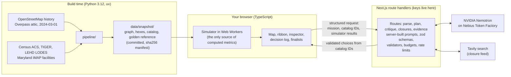

# WorldSeed

**Don't predict the future. Simulate it.**

*Regional averages hide local disasters. A good tool also shows what didn't break.*

Live demo: https://worldseed-mu.vercel.app (no login, runs in your browser)

A regional model says losing the Key Bridge costs about 3 seconds on average. For
about 20,100 people on the Sparrows Point / Edgemere peninsula it cut more than 10%
of the jobs they can reach across the harbor within 30 minutes, and for the eight
hardest-hit block groups, 27-77%. WorldSeed puts those two facts side by side, and
shows the third: first-response times did not change, because both shores have
their own stations.

WorldSeed is a counterfactual infrastructure-planning simulator and a screening
tool. It computes consequences on the 2024 OpenStreetMap road network at free-flow
speeds (congestion appears only in stress futures), with Census population and jobs
data. You remove a link and see who is affected. It then screens a catalog of
hypothetical scenario options for where mitigation would matter, using NVIDIA
Nemotron on Nebius Token Factory as the search planner. The language model never
produces a number: the simulator computes every metric, cited Census data supplies
the population figures, and application templates write every result sentence.

Built for the Nebius x NVIDIA Global AI Hackathon, track **Best Apps and Agents**.

> In memory of the six construction workers lost when the Francis Scott Key
> Bridge collapsed on March 26, 2024. This is a planning tool, not live dispatch.

## What it does

- **Loads a place at a date.** A 36,610-node drivable road graph built from
  OpenStreetMap history (2024-03-01) that includes the Key Bridge and both harbor
  tunnels, plus Census block groups, LEHD jobs, 74 fire stations, 2 ambulance
  stations and 10 hospitals.
- **Removes a link and recomputes.** One click on "Remove Key Bridge link" and every
  lens is recomputed on the road network, in your browser. Terrain rises where the
  change is.
- **Shows the answer honestly, side by side.** Three lenses stay visible at once:
  first response, regional job access, and cross-harbor job access. The region-wide
  number is never hidden behind the local one, and neither is the thing that held.
- **Explains a place.** Click any hexagon for its block group, Census figures and
  the route that changed (dim = before, bright = now).
- **Screens hypothetical options.** Give it a goal in plain language. A planner
  proposes bundles of options from a 24-entry catalog of hypothetical scenario
  options; the simulator scores each bundle across many simulated stress futures;
  you compare finalists and decide. It does not find a fix, and it does not design
  anything. See the finding below.
- **Checks live news, with you in the loop.** A Tavily lookup can propose current
  road closures near the model area. Nothing enters the model until you read the
  source and confirm it.

## Who it is for

Resilience and criticality screening for state DOT and metropolitan planning
organization analysts: the question "if this crossing is lost, who loses access, and
where would mitigation matter?" Emergency managers are a secondary audience, through
the first-response lens as a resilience check. It is screening, not design. The Key
Bridge is the case study. (Screening other crossings is [PLANNED]; the data pipeline
is configurable by bounding box, but the app is built around this one region today.)

WorldSeed is not affiliated with or endorsed by any agency.

## The finding

The obvious question, "did emergency response break?", has a boring answer. The
interesting result is somewhere else.

| Question | What the simulation shows, Key Bridge link removed |
| --- | --- |
| Did first-response times change? | **No. It held.** The simulated 90th-percentile time stays at 6.1 min; 96% of residents remain within 8 min. Both shores have their own fire stations and hospitals. |
| Did regional job access change? | **Barely.** About +3 seconds on the average drive to the region's main job centers. Most trips in the region never used the bridge. |
| Did cross-harbor job access change? | **Yes, for the Sparrows Point / Edgemere peninsula.** The 8 hardest-hit block groups lose 27-77% of the jobs on the other shore reachable within 30 minutes. About 20,100 residents lose more than 10% of those jobs; about 11,400 lose more than 25%. The worst-off 1% add at least 4.3 min to the average cross-harbor trip. |
| Were low-wage workers hit harder? | **Not disproportionately.** 1,380 low-wage workers lose more than 10% of cross-harbor jobs: 1.8% of low-wage workers against 1.9% of all residents. The tool reports this gap either way. |
| Did the tool find a fix? | **No.** In the catalog measurements only about four of the 24 hypothetical options meaningfully help, and the shuttle links did not. The best single option recovers about 40% of the cross-harbor loss, and that result comes from an assumed corridor speed factor, not from an agency study. |

Every figure above is either computed by the simulator from the snapshot in this
repository or is cited Census data; none is typed by hand. The plain-language
reading (region-wide, cross-harbor, where, first response) is generated in the app
by templates from those results. Figures come from free-flow travel times on 2024
data and are simulated results, not measurements. See
[Known modeling limitations](#known-modeling-limitations).

## How it works



Design rules that shape the code:

1. **One abstraction.** Every change to the world (a closure, a scenario option, a
   confirmed news report) compiles to an edge-enable and edge-cost vector over a
   fixed, immutable road graph. The simulator is a pure function of that compiled
   world, so results are deterministic, diffable and undoable.
2. **The browser is the compute.** The simulator is TypeScript running in Web
   Workers, so the demo costs nothing to keep running and has no cold starts.
   Results are labeled "Computed locally in your browser".
3. **The server holds keys and nothing else.** It builds every prompt from
   server-side templates and accepts only structured, schema-validated input. There
   is no generic model proxy.
4. **The model proposes; the simulator scores; the model can never state a metric;
   templates speak.** See the next section.

## How NVIDIA Nemotron and Nebius Token Factory are used

WorldSeed calls NVIDIA Nemotron models through the OpenAI-compatible endpoint of
Nebius Token Factory (`https://api.tokenfactory.nebius.com/v1/`), server-side only.
Four roles (planner, critic, parser, extractor) each have an ordered candidate list of models in
`frontend/lib/server/models.ts`. Model IDs are resolved at runtime from the
account's `/models` list (`/api/health` reports which one each role got), so the app
shows the model that actually ran. The candidate IDs were read from the public
catalog; none has answered a real call yet.

| Role | Model class | What it does | What it does NOT do |
| --- | --- | --- | --- |
| Planner | Largest available Nemotron reasoning model | Proposes, refines and finalizes bundles of 1-3 options, chosen only from catalog IDs, at most 3 rounds and 12 evaluated bundles per mission. Picks a rationale kind from a fixed list. | Write any number or result, name an ID that is not in the catalog, or put text on a card. Bundle IDs are minted by the application. Its optional raw reasoning is shown only in a collapsed, labeled log section (see below). |
| Critic | Largest available Nemotron reasoning model | Reads the simulator's evaluation table and picks one stress test from a closed set (a tunnel or corridor closed and/or a time of day); flags concerns by fixed kind (worst case, equity, cost, feasibility); may veto evaluated bundles. | Score anything, describe a stress in its own words, or introduce bundles that were not evaluated. The simulator re-scores the leaders under the stress it picked. |
| Parser | Small Nemotron model | Turns a plain-language mission into a structured goal (lens, metric, constraints). You confirm it as chips. | Set the numeric target; that comes from a picker you control. |
| Extractor | Small Nemotron model | Reads Tavily search results and extracts closure claims with a verbatim quote. | Decide what is a closure: the quote must appear in the source text, is screened, and roads are matched to the model area by deterministic code. |

Model overrides: `WS_MODEL_PLANNER`, `WS_MODEL_CRITIC`, `WS_MODEL_PARSER` and
`WS_MODEL_EXTRACTOR`.

**The search loop.** Propose, simulate, stress, refine, finalize. The planner proposes
bundles; the browser simulator scores them across many futures; the critic picks one
stress test from a closed set (a tunnel closed and/or a time of day); the simulator
re-scores the leaders under that stress; the planner refines; then it finalizes three
finalists. When the AI is unavailable or its output is rejected, a deterministic
(no-AI) critic runs the same stress step by re-scoring the leaders under each
single-link closure and choosing the one that hurts them most, and the loop continues,
labeled "not AI".

**The guardrails that make this safe to demo:**

- **No number from a model.** The catalog shown to the model carries IDs, titles,
  types and cost tiers but no numeric effects. The model may read the simulator's
  results table; its output schema has no place for a number, and every result
  figure on screen is filled from the simulator (or cited Census data) by the
  application.
- **Its "why" is a selection, not prose.** The model picks one of eight rationale
  kinds (for example "worst case first"). The application renders the sentence, and
  it appears only in the decision log, labeled "AI rationale (unverified; not a
  result)". Finalist cards and all result text are application templates.
- **One labeled exception: raw reasoning.** A planner or critic reply may carry an
  optional reasoning string. It appears only in a collapsed section of the decision log
  labeled "Model reasoning (raw, unverified; not a result)", with the model name, token
  counts and latency. It is checked only for plain-text form (length, plain characters,
  no digits, no links, no markup); it is not checked for truth. It is never used for a
  decision and never appears on a card. If it fails the screen it is blanked and the log
  says so; the answer itself is still used.
- **Strict validators, in the browser and again on the server.** Unknown keys are
  rejected; every candidate must exist in the catalog, match the lens, and respect the
  cost tier; finalists must be three distinct bundles that were actually evaluated.
  On a violation there is one repair turn, then the app falls back to a deterministic
  search labeled "not AI". Every rejection is shown in the decision log.
- **Budgets and abuse controls.** A global daily spend ceiling (default $1), a
  per-mission token budget, per-client limits, an in-memory front door, an optional
  Turnstile check, and a kill switch (`WS_LIVE_AI`). When the AI is unavailable the
  panel says so and manual exploration and deterministic search still work.
- **Independently red-teamed in multiple rounds.** The server and abuse-control code
  went through several adversarial review rounds; fixes are pinned by regression
  tests (`frontend/test/ai/round*.test.ts`, `frontend/test/sim/round4.test.ts`).

**Exhaustive-search check (built, UI wiring in progress).** `frontend/lib/agent/exhaustive.ts`
scores every bundle of up to three eligible catalog options with the simulator's
deterministic run and reports the true optimum, so the AI's finalists can be ranked
against it. It never calls a model. It is not yet wired into the interface.

**Verification status, stated plainly.** The planner, critic (including the adversarial
stress step), parser and extractor paths, and the deterministic critic, are built and
covered by tests that use a fake provider. They have **not yet been verified against live Nemotron models on Token Factory**: no API
key is deployed on the demo yet and model availability on our account is
unconfirmed. Until that is done the live site shows that AI planner setup is in
progress, and the deterministic search is the path that works without a key. This
section will be updated when the live check is done (see [Status](#status)).

## Tavily: live road-closure feed

Status: implemented and tested; live lookup pending a deployed key.

`/api/closures` runs one fixed Tavily news search for Baltimore-area closures (last
14 days, 8 results), then:

1. the extractor model proposes closures, each with a quote;
2. the server checks that every quote appears in the source text (grounding);
3. a screen rejects partial closures (one lane, trucks only), completed or reopened
   events, hypotheticals and drills, hearsay, and items outside the model area;
4. roads are matched to the gazetteer deterministically;
5. survivors are shown as **unverified news reports** with the source link and
   quote. You must read them and confirm; a signed, single-use token is required to
   add one to the model. Nothing is added automatically.

If nothing qualifies, the app says so. Results are cached, capped per day, and never
written to the repository.

**Reality-check evidence (built, live lookup pending a key; interface wiring in
progress).** `/api/evidence` runs one fixed Tavily search per topic (detours, traffic
or freight after the 2024 collapse) and returns sources only: title, domain, date,
snippet and link, all labeled unverified. It makes no model call, extracts no claims,
and does not compare anything to the simulator's numbers. It exists so a reader can
check the model's picture against published reporting.

## How the simulation and its assumptions work

- **Graph.** Drive network from OpenStreetMap as of 2024-03-01, with the six I-695
  Key Bridge ways registered as one link (`L-KEYBRIDGE`), and the Fort McHenry and
  Harbor Tunnels flagged as tunnels. Free-flow speeds (posted `maxspeed`, else a
  default per road class); no signals, turns or congestion in the deterministic run.
- **People and jobs.** H3 resolution-9 hexagons carry population, households without
  a vehicle and low-wage workers (ACS 5-year and LODES, apportioned by area) and
  jobs (LODES workplace blocks). Population and household figures are cited Census
  estimates; travel times, access and losses are simulator outputs.
- **Lenses.**
  - *First response*: nearest fire or EMS station, with a 1-minute call-processing
    and turnout delay (`A-CALL-TO-WHEELS`).
  - *Regional access*: job-weighted mean drive time to 8 job-center anchors.
  - *Cross-harbor access*: jobs on the opposite shore reachable within 30 minutes.
    This lens was defined before its results were seen, because the region-wide
    average hides what the bridge actually did: cross the Patapsco. 20 and 40
    minutes are reported as sensitivity, not chosen after the fact.
- **Futures.** Candidate options are tested across many seeded stress futures
  (traffic multipliers by time of day, occasional closures of other links). This is
  where congestion enters. Every option is evaluated on the same seeds, so
  comparisons are paired and fair. The seed is shown and runs are reproducible.
  These are stress scenarios, not a traffic forecast.
- **Catalog.** 24 hypothetical scenario options: 7 temporary links (shuttle links and
  connectors), 8 corridor priorities and 9 staging sites. None was proposed, studied
  or endorsed by any agency. Costs are relative tiers ($, $$, $$$), never dollar
  figures. The effect sizes are labeled assumptions.
- **Every constant is labeled.** `pipeline/assumptions.yaml` lists each parameter with
  its source, or "assumption". The **Assumptions** button in the app shows them.

## Data sources and licenses

| Data | Source | License |
| --- | --- | --- |
| Roads, facilities, place names | OpenStreetMap via Overpass (attic query, 2024-03-01), (c) OpenStreetMap contributors | ODbL 1.0 (derived snapshot is ODbL 1.0) |
| Fire stations and hospitals (second source) | Maryland iMAP | State of Maryland data disclaimer (to be confirmed by legal review) |
| Population, households, vehicles | U.S. Census Bureau ACS 5-year (2020-2024) via the Census Reporter mirror | Public domain (U.S. Government work); mirror terms to be confirmed |
| Block-group geometry | Census TIGER/Line cartographic boundaries 2023 | Public domain |
| Jobs and low-wage workers | Census LEHD LODES8, Maryland 2023 | Public domain |
| Basemap tiles | OpenFreeMap, (c) OpenMapTiles, data from OpenStreetMap | See map attribution in the app |

Full detail, fetch methods, merge rules and known gaps: [docs/DATA_SOURCES.md](docs/DATA_SOURCES.md).
The app's map attribution stays on, and the footer credits the data, the AI and the
search services.

## Setup and run

Requirements: Node 20+ (developed on Node 24) for the app; `uv` with Python 3.12 for
the pipeline (only if you want to rebuild the snapshot; a built snapshot is committed).

**Frontend**

```bash
cd frontend
npm install
npm run dev          # http://localhost:3000
```

The map and simulator need no keys. Other scripts: `npm run build`, `npm run lint`,
`npm run typecheck`, `npm test`. More detail: [frontend/README.md](frontend/README.md).

**Snapshot pipeline (optional, build time only)**

```bash
cd pipeline
uv run --python 3.12 python -m worldseed_pipeline.run_all
```

Downloads are cached in `data/raw/` (git-ignored). The pipeline needs no keys and
costs nothing; the running app never calls Overpass. Outputs land in `data/snapshot/`
with a sha256 manifest, and the frontend copies them to `public/snapshot/` on
`predev` and `prebuild`. Pipeline tests: `uv run --python 3.12 python -m pytest`
from `pipeline/`.

**Environment variables (AI and closure features only)**

Copy `.env.example` to `frontend/.env.local` and fill in what you have. Keys are read
only on the server and must never be prefixed `NEXT_PUBLIC_`.

| Variable | Purpose |
| --- | --- |
| `NEBIUS_API_KEY`, `NEBIUS_BASE_URL` | Token Factory access for the Nemotron roles |
| `TAVILY_API_KEY` | Closure feed |
| `WS_CONFIRM_SECRET` | Signs closure-confirmation tokens; required in production or closure search stays off |
| `WS_LIVE_AI` | Kill switch; any value other than unset/on/1/true/yes turns AI off |
| `UPSTASH_REDIS_REST_URL`, `UPSTASH_REDIS_REST_TOKEN` (or `KV_REST_API_*`) | Shared store for rate limits and the daily budget; without it limits are per process |
| `WS_MODEL_*`, `WS_DAILY_BUDGET_USD`, `WS_MISSION_*`, `WS_IP_*`, and others | Optional overrides, documented inline in `.env.example` |

Without keys the app still runs: AI features report that the planner is unavailable,
and you can explore scenarios by hand.

**Deploying.** The app is a Next.js project with root directory `frontend/` (the
demo is on Vercel Hobby).

## Reproduce the Key Bridge scenario

1. Open the live demo, or run the frontend locally, and step through or skip the intro.
2. Click **Remove Key Bridge link**. The baseline reads 20.6 min average cross-harbor
   trip; after removal the terrain rises over the Sparrows Point / Edgemere
   peninsula and the ribbon shows the deltas.
3. Read the ribbon: regional access about +3 s, first response unchanged,
   cross-harbor access with about 20,100 residents losing more than 10% of reachable
   jobs. Switch lenses above the map; the ribbon keeps all of them visible.
4. Click a populated hexagon to see its block group, Census figures and the route
   that changed.
5. Open **Assumptions** to see every parameter and data vintage.
6. To check the numbers without the UI: `cd frontend && npm test` runs the simulator
   against the reference results in `data/snapshot/golden.json`.

A guided version of this walk-through (`?tour=keybridge`) is in progress; see
[Status](#status).

## Validation

- **Independent reference.** The Python pipeline computes reference results
  (`golden.json`) with networkx and scipy for the baseline, the bridge-removed world
  and candidate bundles. The TypeScript simulator is tested against them, hex by
  hex, within 0.5 s per hex for time-based fields.
- **Determinism.** Seeded, paired futures; the same inputs give the same numbers.
- **Data checks.** The pipeline asserts the Key Bridge and tunnel ways (by OSM id
  and tags) and fails the build on unresolved catalog IDs or numbers in catalog
  text. Snapshot files are hashed in `manifest.json`.
- **Model output checks.** Validators, prose screens and fake-provider tests cover the
  planner, critic, parser, extractor and closure screen.
- **One caveat, stated up front.** The cross-harbor lens in the app is a fast variant
  (job-weighted anchors); the exact all-pairs version is the test oracle, and its
  headline counts differ slightly (for example about 19,700 versus about 20,100
  residents losing more than 10%).
- **Not validated against observed traffic.** An evidence endpoint can list published
  sources about the 2024 detours (sources only, unverified; see the Tavily section),
  but nothing compares the model's numbers to observations, and nothing here should be
  read as validated against observed traffic.

## Known modeling limitations

- Free-flow driving only in the deterministic run: no signals, turn delays or
  congestion, so tunnel and bridge-approach delays are understated; congestion enters
  only through stress futures. Cars only: no transit, walking or freight schedules.
  Freight and hazmat trip routing is [PLANNED] (pipeline work in progress), not modeled.
- The first-response lens counts every fire station as a source and does not model
  unit counts, staffing, availability or stations outside the study area
  (bbox W -76.80, S 39.10, E -76.40, N 39.34), which can make edge block groups look
  under-served.
- Shuttle links are one graph edge with a baked wait in a car-drive-time model; mode
  change and schedules are not modeled.
- The bridge is removed as a link, not modeled as an event; the model says nothing
  about cause or the collapse itself.
- ACS block-group estimates carry sampling error; LODES is noise-infused; hex values
  are area-apportioned estimates. The ACS vintage (2020-2024) straddles 2024.
- Neighborhood extents come from the nearest OSM place node, not official boundaries.
- All 24 catalog options are hypothetical, with assumed (not sourced) effects. Any
  "recovery" figure for an option rests on those assumptions.

## Feedback for Nebius and NVIDIA

The hackathon asks for feedback on Token Factory and the NVIDIA models. Raw notes
are collected as they happen in [docs/FEEDBACK_NOTES.md](docs/FEEDBACK_NOTES.md);
the final write-up is compiled from it.

## Docs

- [Status board](docs/STATUS.md): what is done, in progress, next, blocked; submission checklist and key dates.
- [Architecture](docs/ARCHITECTURE.md): design decisions, data contract, agent tools and validator rules.
- [Data sources](docs/DATA_SOURCES.md): every source, method, license and known gap.
- [Feedback notes](docs/FEEDBACK_NOTES.md): running log for the Nebius / NVIDIA feedback the hackathon requires.
- [Attributions](docs/ATTRIBUTIONS.md): data, library, font, and service credits (draft, pending legal review).
- [Dedication](docs/DEDICATION.md): in memory of the six workers lost in the Key Bridge collapse.
- [Devpost text](docs/DEVPOST.md), [demo video script](docs/VIDEO_SCRIPT.md), [pitches and judge Q&A](docs/PITCH.md).

Repo hygiene: run `scripts/check-repo-hygiene.sh` before pushing.

## Status

Last updated: 2026-09-26. Live means it works on https://worldseed-mu.vercel.app
today; in progress means it is not finished or not verified end to end; planned
means it does not exist yet.

- [x] **Live.** Pre-collapse OpenStreetMap road graph and snapshot (Key Bridge, both harbor tunnels, block groups, jobs, facilities)
- [x] **Live.** Browser-side simulator (Web Workers), tested against the independent reference
- [x] **Live.** Remove the Key Bridge link, terrain, side-by-side ribbon (cross-harbor, regional, first response), explainer
- [x] **Live.** Hexagon inspector with block-group figures and the route that changed
- [x] **Live.** Assumptions drawer, About and intended-use text, map and data attribution
- [ ] **In progress.** AI planner path against live Nemotron models on Token Factory: implemented and tested with a fake provider; pending key, unverified live (no API key deployed yet; model availability unconfirmed)
- [ ] **In progress.** Futures fan, finalist cards and deterministic search UI (Compare and Apply flow)
- [ ] **In progress.** Tavily closure feed on the deployed site (code and tests complete; live lookup pending a deployed key)
- [ ] **In progress.** Guided tour (`?tour=keybridge`): runs live actions, no recorded playback exists
- [ ] **In progress.** Adversarial critic loop (propose, simulate, stress, refine, finalize; with a deterministic no-AI critic): built, pending live verification
- [ ] **In progress.** Reality-check evidence endpoint (Tavily sources only, unverified): built, live lookup pending a key, interface wiring in progress
- [ ] **In progress.** Exhaustive-search check of the AI's finalists against the true optimum: built, interface wiring in progress
- [ ] **Planned.** Screening other crossings from the app (the pipeline is bbox-configurable today)
- [ ] **Planned.** Freight and hazmat trip lens (pipeline work in progress)
- [ ] **Planned.** Quantitative comparison of model output to published observations
- [ ] **Not done.** Demo video (under 3:00) and final Devpost submission
- [ ] **Not done.** Written Nebius and NVIDIA feedback, compiled from the notes file

## Intended use and limitations

**Intended use.** WorldSeed is a research and educational prototype for exploring
counterfactual infrastructure-planning scenarios. It is not an emergency dispatch,
triage, routing, or operational decision system, and it must not be used to direct,
prioritize, or delay any real emergency response. In an emergency, call 911.

**Simulated results.** All travel times, coverage figures, and other metrics are outputs
of a simplified simulation using historical, possibly incomplete or outdated open data
(OpenStreetMap, U.S. Census Bureau). They are not measurements or predictions of
real-world performance and do not reflect the actual capabilities, staffing, capacity,
or protocols of any hospital, fire, EMS, or government agency.

**AI-generated text.** Numbers, results, and finalist cards are produced by the
application from simulator results and catalog data. Text written by an AI language
model appears only as a clearly labeled, unverified rationale in the decision log and
may be inaccurate. All options are proposals for human review, not recommendations.

**No affiliation.** Names of hospitals, stations, and agencies identify real-world
locations only. WorldSeed is not affiliated with, endorsed by, or produced in cooperation
with any of them, the State of Maryland, Baltimore City or County, the U.S. Census
Bureau, the NTSB, or the OpenStreetMap Foundation.

**No warranty.** Provided "as is" under the licenses below, without warranty of any kind.

## License

- Source code: MIT (see `LICENSE`).
- Data in `data/snapshot/`: Open Database License 1.0, derived from OpenStreetMap
  (c) OpenStreetMap contributors. See `data/snapshot/LICENSE.md`.
- Third-party notices: see `NOTICE` and `docs/ATTRIBUTIONS.md`.
